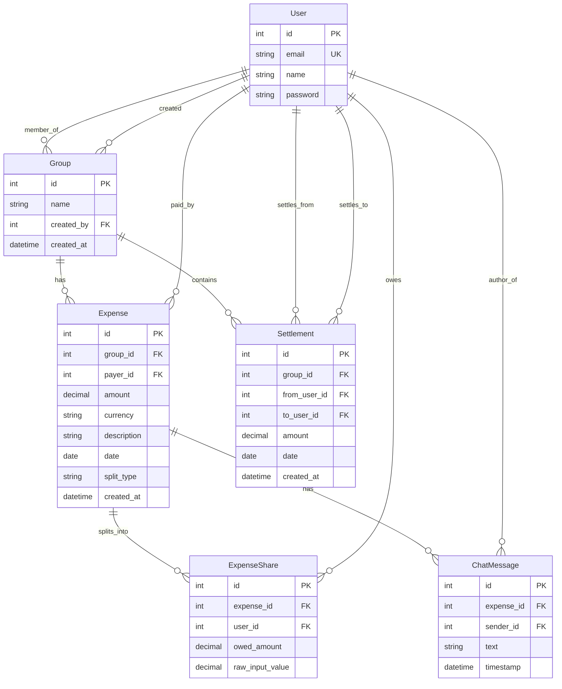

# Scope & Anomaly Logs

This log records the CSV dataset anomalies and the engineering decisions applied to resolve them during import.

## CSV Anomaly Log & Resolutions

| Row | Issue / Anomaly | Decision / Resolution |
| --- | --- | --- |
| 5 & 6 | **Duplicate Entry**: Marina Bites dinner logged twice by Dev. | Import the first entry (proper casing + notes) and skip the second. |
| 7 | **Formatted Amount**: Electricity Feb amount is `"1,200"` (with comma). | Parse string to remove comma and convert to `Decimal('1200.00')`. |
| 10 | **Excess Decimal Places**: Cylinder refill amount is `899.995`. | Round to 2 decimal places: `Decimal('900.00')`. |
| 11 | **Name Alias**: Payer is `Priya S`. | Map `Priya S` to user `Priya` (email `priya@example.com`). |
| 13 | **Missing Payer**: House cleaning supplies payer is empty. | Default payer to `Aisha` (group creator) to balance the sheet, as nobody remembers who paid. |
| 14 | **Settlement in Expense Log**: `Rohan paid Aisha back` 5000 INR. | Import as a `Settlement` from Rohan to Aisha, not as an Expense. |
| 15 & 32 | **Unnormalized Percentages**: Percentages sum to 110%. | Normalize percentages (each share gets `pct / 110`) and distribute the rounding remainder. |
| 20, 21, 23, 26 | **USD Currency**: Expenses in USD (`Goa villa booking`, etc.). | Convert USD to INR using a fixed exchange rate of **83.00 INR/USD**. |
| 23 | **External Guest**: `Dev's friend Kabir` is in the split list. | Create a user for Kabir (`kabir@example.com`) and temporarily add them to the group to calculate correct shares. |
| 24 & 25 | **Double Logged Event**: Thalassa dinner logged by Aisha (2400) and Rohan (2450). | Note in Row 25 says Aisha's is wrong. Import Rohan's (2450) and skip Aisha's (2400). |
| 27 | **Mixed Case/Spaces & Date Format**: `Mar-14` date and `rohan ` name. | Parse date as `2026-03-14` and map name to `Rohan`. |
| 28 | **Missing Currency**: Groceries DMart has empty currency. | Default to `INR`. |
| 31 | **Zero-Amount / Correction**: Swiggy dinner has amount `0`. | Skip this entry entirely as it was flagged as a duplicate/correction. |
| 34 | **Date Out-of-Order**: Date is `04-05-2026` but sits between March 28 and April 1. | Chronological context implies `05-04-2026` (April 5, 2026). Parse as `2026-04-05`. |
| 38 | **Settlement in Expense Log 2**: `Sam deposit share` 15000 INR to Aisha. | Import as a `Settlement` from Sam to Aisha, not as an Expense. |
| 42 | **Redundant split details**: Split type is `equal` but lists shares `Aisha 1; Rohan 1; ...` | Split equally among the listed participants. |

---

## Entity Relationship Diagram (ERD)

